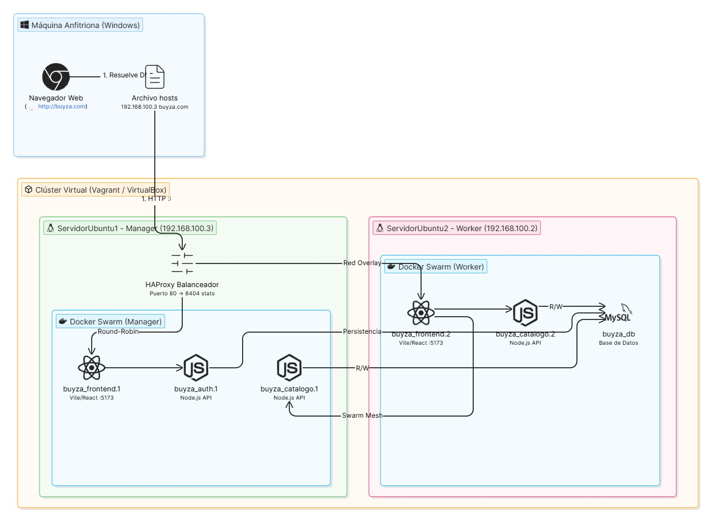

# 🛒 Buyza — Marketplace con Microservicios

> **Proyecto Final — Módulo de Infraestructura**  
> Curso de Redes e Infraestructura · Universidad Autónoma de Occidente  
> Profesor: Oscar Mondragón

---

## 📌 ¿Qué es Buyza?

**Buyza** es una plataforma tipo marketplace desarrollada bajo una arquitectura de **microservicios**, donde los usuarios pueden registrarse como compradores o vendedores, explorar un catálogo de productos, realizar compras a crédito y gestionar sus pagos, todo desde una interfaz web ligera.

El sistema implementa autenticación con **JWT**, control de roles, comunicación inter-servicios mediante HTTP/REST, empaquetado con **Docker**, orquestación con **Docker Swarm**, balanceo de carga con **HAProxy** y análisis de datos distribuido con **Apache Spark (PySpark)**.

---

## 🗃️ Dataset

El dataset base utilizado para poblar y analizar la plataforma proviene de Kaggle:

> **E-Commerce Marketplace Dataset**  
> 🔗 [https://www.kaggle.com/datasets/danielcontrerasdiaz/e-commerce-marketplace-dataset](https://www.kaggle.com/datasets/danielcontrerasdiaz/e-commerce-marketplace-dataset)

Este dataset contiene información de usuarios, productos, órdenes, pagos y movimientos de crédito en un marketplace de e-commerce, que fue adaptado e importado en las bases de datos MySQL del proyecto. Los archivos SQL de exportación (`catalogo_export.sql`, `ordenes_export.sql`, `pagos_export.sql`, `credito_export.sql`, `usuarios_export.sql`) en la raíz del repositorio ya contienen los datos listos para importar.

---

## 🧩 Arquitectura



El sistema está compuesto por **6 microservicios** independientes, cada uno con su propia base de datos MySQL, comunicándose entre sí por HTTP:

| Microservicio | Puerto | Base de datos | Función |
|---|---|---|---|
| `ms-usuarios` | 3001 | `buyza_usuarios` | Registro, login, roles, estados |
| `ms-catalogo` | 3002 | `buyza_catalogo` | Gestión de productos e inventario |
| `ms-ordenes` | 3003 | `buyza_ordenes` | Creación y gestión de compras |
| `ms-pagos` | 3004 | `buyza_pagos` | Procesamiento de pagos y transacciones |
| `ms-credito` | 3005 | `buyza_credito` | Cupo de crédito, cuotas e historial |
| `ms-estadisticas` | 3006 | *(multi-DB)* | Dashboard de estadísticas + resultados Spark |

El **frontend** es una aplicación HTML/JS estática servida por Apache en el puerto `8080` (Docker) o directamente desde un servidor de archivos en entorno local.

**HAProxy** actúa como balanceador de carga en los puertos `4001` (usuarios) y `4002` (catálogo), y expone el panel de estadísticas en el puerto `5081`.

---

## ⚠️ Nota sobre el Microservicio de Estadísticas

> El microservicio `ms-estadisticas` fue incorporado **a última hora del desarrollo** por necesidades de funcionalidad del proyecto. A diferencia del resto de microservicios que tienen su propia base de datos aislada, este servicio se conecta **en modo lectura** a todas las bases de datos del sistema para consolidar métricas en tiempo real. Adicionalmente, consume los resultados JSON generados por el job de **Apache Spark** (`analisis_spark.py`) para mostrar análisis distribuido en el dashboard. Esto lo convierte en el componente central del módulo de infraestructura de datos a gran escala requerido en la segunda parte del proyecto.

---

## ⚙️ Stack Tecnológico

| Capa | Tecnología |
|---|---|
| Backend (Microservicios) | Node.js 18 + Express |
| Base de datos | MySQL 8.0 |
| Autenticación | JWT (jsonwebtoken) |
| Comunicación inter-servicios | Axios (HTTP) |
| Contenedores | Docker + Docker Compose |
| Orquestación (producción) | Docker Swarm |
| Balanceo de carga | HAProxy 2.8 |
| Análisis de datos | Apache Spark 3.5 (PySpark) |
| Frontend | HTML5 + CSS3 + JavaScript vanilla |
| Servidor web (frontend) | Apache (php:8.1-apache) |
| Entorno de desarrollo | Vagrant + Ubuntu 22.04 VM |

---

## 👤 Roles de Usuario

### 🛍️ Comprador
- Se registra y queda activo automáticamente
- Puede ver el catálogo de productos
- Puede comprar productos (genera una orden y descuenta crédito)
- Puede pagar sus órdenes
- Tiene un cupo de crédito asignado (default: $100.000)

### 🏪 Vendedor
- Se registra y queda en estado `pendiente`
- Un admin debe aprobarlo antes de que pueda operar
- Una vez activo, puede publicar, editar y desactivar productos
- Sus productos se aprueban automáticamente al crearlos (no requieren aprobación manual)

### 🛠️ Admin
- Aprueba o rechaza cuentas de vendedores
- Puede ajustar el cupo de crédito de los usuarios
- Puede aprobar productos manualmente si fuera necesario
- Tiene acceso al panel de administración

---

## 🔐 Autenticación

Se usa **JWT (JSON Web Token)** con expiración de **7 días**.

El token incluye el `id` y el `rol` del usuario. Se debe enviar en el header de cada request protegido:

```
Authorization: Bearer <token>
```

Si el token expira o es inválido, el frontend redirige automáticamente al login.

---

## 🔄 Flujo Completo del Sistema

```
1. REGISTRO
   └─ Comprador  → estado: activo  (acceso inmediato)
   └─ Vendedor   → estado: pendiente (espera aprobación)

2. APROBACIÓN (solo admin)
   └─ Admin cambia estado del vendedor a "activo"

3. PUBLICACIÓN DE PRODUCTO (vendedor activo)
   └─ POST /api/catalogo  → producto queda activo y aprobado

4. COMPRA (comprador autenticado)
   └─ POST /api/ordenes/crear
        ├─ ms-ordenes consulta precio a ms-catalogo
        ├─ ms-ordenes descuenta cupo en ms-credito
        ├─ Se crea la orden en buyza_ordenes
        └─ Se reduce el stock en buyza_catalogo

5. PAGO (comprador)
   └─ POST /api/pagos/procesar
        ├─ ms-pagos registra la transacción
        ├─ Si el pago completa el total → orden pasa a "pagada"
        └─ ms-pagos notifica a ms-credito para liberar/actualizar cupo

6. ESTADÍSTICAS (dashboard)
   └─ GET /api/estadisticas/completo
        ├─ ms-estadisticas consulta todas las DBs en tiempo real
        └─ Si existe /spark-results/estadisticas.json → lo incluye también
```

---

## 📡 Referencia Completa de Endpoints

### 🔐 Usuarios — Puerto 3001

| Método | Ruta | Auth | Descripción |
|---|---|---|---|
| POST | `/api/usuarios/registro` | ❌ | Registrar usuario |
| POST | `/api/usuarios/login` | ❌ | Iniciar sesión |
| GET | `/api/usuarios/perfil` | ✅ Token | Ver perfil propio |
| GET | `/api/usuarios/` | ✅ Admin | Listar todos los usuarios |
| PUT | `/api/usuarios/:id/estado` | ✅ Admin | Aprobar/rechazar usuario |
| DELETE | `/api/usuarios/:id` | ✅ Admin | Eliminar usuario |

### 📦 Catálogo — Puerto 3002

| Método | Ruta | Auth | Descripción |
|---|---|---|---|
| GET | `/api/catalogo/` | ❌ | Listar productos activos |
| GET | `/api/catalogo/:id` | ❌ | Obtener producto por ID |
| POST | `/api/catalogo/` | ✅ Vendedor | Publicar nuevo producto |
| PUT | `/api/catalogo/:id` | ✅ Vendedor | Editar producto propio |
| PUT | `/api/catalogo/:id/desactivar` | ✅ Vendedor | Desactivar producto |
| PUT | `/api/catalogo/:id/reducir-stock` | ❌ (interno) | Reducir stock tras compra |
| PUT | `/api/catalogo/:id/aprobar` | ✅ Admin | Aprobar producto manualmente |

### 🧾 Órdenes — Puerto 3003

| Método | Ruta | Auth | Descripción |
|---|---|---|---|
| POST | `/api/ordenes/crear` | ✅ Token | Crear orden (un producto) |
| POST | `/api/ordenes/` | ✅ Token | Crear orden (múltiples productos con crédito) |
| GET | `/api/ordenes/usuario/:id` | ✅ Token | Ver órdenes de un usuario |
| GET | `/api/ordenes/info/:id` | ❌ (interno) | Info de orden para ms-pagos |
| GET | `/api/ordenes/:id` | ✅ Token | Detalle de una orden |
| PUT | `/api/ordenes/:id/estado` | ❌ (interno) | Actualizar estado de orden |

### 💳 Pagos — Puerto 3004

| Método | Ruta | Auth | Descripción |
|---|---|---|---|
| POST | `/api/pagos/procesar` | ✅ Token | Procesar pago de una orden |
| GET | `/api/pagos/estado-cuenta/:id_orden` | ✅ Token | Estado financiero de la orden |
| GET | `/api/pagos/suma/:id` | ❌ | Suma total pagada por orden |

### 💰 Crédito — Puerto 3005

| Método | Ruta | Auth | Descripción |
|---|---|---|---|
| GET | `/api/credito/mio` | ✅ Comprador | Ver cupo propio |
| GET | `/api/credito/cuotas` | ✅ Comprador | Ver cuotas pendientes |
| GET | `/api/credito/historial` | ✅ Comprador | Ver historial de movimientos |
| POST | `/api/credito/liquidar` | ✅ Comprador | Liquidar toda la deuda |
| POST | `/api/credito/pagar/:cuota_id` | ✅ Comprador | Pagar una cuota específica |
| POST | `/api/credito/usar` | ❌ (interno) | Descontar cupo tras orden |
| GET | `/api/credito/admin/usuario/:usuario_id` | ✅ Admin | Ver crédito de un usuario |
| PUT | `/api/credito/admin/usuario/:usuario_id/ajustar` | ✅ Admin | Ajustar cupo de usuario |

### 📊 Estadísticas — Puerto 3006

| Método | Ruta | Auth | Descripción |
|---|---|---|---|
| GET | `/api/estadisticas/resumen` | ❌ | Resumen general en tiempo real |
| GET | `/api/estadisticas/usuarios` | ❌ | Estadísticas de usuarios |
| GET | `/api/estadisticas/productos` | ❌ | Estadísticas de productos |
| GET | `/api/estadisticas/ventas` | ❌ | Estadísticas de ventas y órdenes |
| GET | `/api/estadisticas/credito` | ❌ | Estadísticas de crédito |
| GET | `/api/estadisticas/completo` | ❌ | Todo en una sola llamada (para dashboard) |
| GET | `/api/estadisticas/spark` | ❌ | Resultados del análisis PySpark |
| GET | `/health` | ❌ | Health check del servicio |

---

## 🚀 Cómo ejecutar el proyecto — Paso a paso

Hay dos formas de ejecutar Buyza: con **Docker Compose** (recomendado, todo automatizado) o **manualmente en una VM** (para desarrollo o sin Docker).

---

### Opción A — Docker Compose (Recomendado) 🐳

#### Prerequisitos
- Docker Engine instalado (`docker --version`)
- Docker Compose instalado (`docker compose version`)
- Git instalado

#### Paso 1 — Clonar el repositorio

```bash
git clone <URL_DEL_REPOSITORIO>
cd Buyza
```

#### Paso 2 — Aplicar el fix crítico en `ordenesController.js`

Antes de construir, corrige el bug de la URL duplicada en el microservicio de órdenes:

Abre `microservicio-ordenes/src/controllers/ordenesController.js` y en la función `router.post('/crear', ...)` busca esta línea:

```javascript
// ❌ INCORRECTO — genera URL duplicada tipo /api/catalogo/api/catalogo/1
const resp = await axios.get(`${CATALOGO_URL}/api/catalogo/${id_producto}`, axiosConfig);
```

Cámbiala por:

```javascript
// ✅ CORRECTO
const resp = await axios.get(`${CATALOGO_URL}/${id_producto}`, axiosConfig);
```

#### Paso 3 — Levantar todos los servicios

```bash
docker compose -f Docker-compose.yml up --build -d
```

Esto levantará:
- 5 contenedores MySQL (uno por base de datos)
- 5 microservicios Node.js
- 1 frontend Apache
- 1 HAProxy

> ⏳ La primera vez puede demorar 2-5 minutos mientras descarga imágenes y compila.

#### Paso 4 — Importar los datos de la base de datos

Los servicios MySQL arrancan vacíos. Debes importar los archivos SQL del repositorio:

```bash
# Usuarios
docker exec -i db_usuarios mysql -u root buyza_usuarios < usuarios_export.sql

# Catálogo (productos)
docker exec -i db_catalogo mysql -u root buyza_catalogo < catalogo_export.sql

# Órdenes
docker exec -i db_ordenes mysql -u root buyza_ordenes < ordenes_export.sql

# Pagos
docker exec -i db_pagos mysql -u root buyza_pagos < pagos_export.sql

# Crédito
docker exec -i db_credito mysql -u root buyza_credito < credito_export.sql
```

> 💡 Los datos provienen del dataset de Kaggle **E-Commerce Marketplace Dataset** adaptado para este proyecto.

#### Paso 5 — Verificar que todo está corriendo

```bash
docker compose ps
```

Deberías ver todos los servicios con estado `Up`:

```
db_usuarios     Up   0.0.0.0:3311->3306/tcp
db_catalogo     Up   0.0.0.0:3312->3306/tcp
db_ordenes      Up   0.0.0.0:3313->3306/tcp
db_pagos        Up   0.0.0.0:3314->3306/tcp
db_credito      Up   0.0.0.0:3315->3306/tcp
ms_usuarios     Up   0.0.0.0:3001->3001/tcp
ms_catalogo     Up   0.0.0.0:3002->3002/tcp
ms_ordenes      Up   0.0.0.0:3003->3003/tcp
ms_pagos        Up   0.0.0.0:3004->3004/tcp
ms_credito      Up   0.0.0.0:3005->3005/tcp
buyza_front     Up   0.0.0.0:8080->80/tcp
haproxy         Up   0.0.0.0:4001->4001/tcp, 0.0.0.0:4002->4002/tcp
```

#### Paso 6 — Acceder a la aplicación

| Servicio | URL |
|---|---|
| **Frontend (App)** | http://localhost:8080 |
| **HAProxy Stats** | http://localhost:5081/haproxy?stats |
| **API Usuarios** | http://localhost:3001/api/usuarios |
| **API Catálogo** | http://localhost:3002/api/catalogo |
| **API Estadísticas** | http://localhost:3006/api/estadisticas/resumen |

#### Paso 7 — Registrar un usuario administrador inicial

Para tener acceso completo, crea un admin directamente en la DB de usuarios:

```bash
docker exec -it db_usuarios mysql -u root buyza_usuarios -e \
  "INSERT INTO usuarios (nombre, email, password, rol, estado) VALUES ('Admin', 'admin@buyza.com', '\$2b\$10\$HASH_AQUI', 'admin', 'activo');"
```

O más fácil, regístrate en la UI y luego actualiza el rol directamente:

```bash
# Primero regístrate en http://localhost:8080/pages/registro.html
# Luego actualiza a admin:
docker exec -it db_usuarios mysql -u root buyza_usuarios -e \
  "UPDATE usuarios SET rol='admin', estado='activo' WHERE email='tu@email.com';"
```

---

### Opción B — Ejecución manual en VM/local (sin Docker) 🖥️

Esta opción es para quien tiene los microservicios corriendo directamente en una VM Ubuntu o en su máquina local.

#### Prerequisitos
- Node.js 18+
- MySQL 8.0 corriendo localmente
- Git

#### Paso 1 — Clonar el repositorio

```bash
git clone <URL_DEL_REPOSITORIO>
cd Buyza
```

#### Paso 2 — Crear las bases de datos en MySQL

```sql
CREATE DATABASE buyza_usuarios;
CREATE DATABASE buyza_catalogo;
CREATE DATABASE buyza_ordenes;
CREATE DATABASE buyza_pagos;
CREATE DATABASE buyza_credito;
```

#### Paso 3 — Importar los datos

```bash
mysql -u root -p buyza_usuarios  < usuarios_export.sql
mysql -u root -p buyza_catalogo  < catalogo_export.sql
mysql -u root -p buyza_ordenes   < ordenes_export.sql
mysql -u root -p buyza_pagos     < pagos_export.sql
mysql -u root -p buyza_credito   < credito_export.sql
```

#### Paso 4 — Configurar variables de entorno de cada microservicio

Cada microservicio tiene un archivo `.env.template` en su carpeta. Copia y configura cada uno:

```bash
# Repite esto para cada microservicio
cp microservicio-usuarios/.env.template microservicio-usuarios/.env
```

**`microservicio-usuarios/.env`**
```env
PORT=3001
DB_HOST=localhost
DB_USER=root
DB_PASSWORD=tu_password
DB_NAME=buyza_usuarios
JWT_SECRET=PassMarketplace0001
```

**`microservicio-catalogo/.env`**
```env
PORT=3002
DB_HOST=localhost
DB_USER=root
DB_PASSWORD=tu_password
DB_NAME=buyza_catalogo
JWT_SECRET=PassMarketplace0001
```

**`microservicio-ordenes/.env`** ← ⚠️ Este tiene variables extra críticas
```env
PORT=3003
DB_HOST=localhost
DB_USER=root
DB_PASSWORD=tu_password
DB_NAME=buyza_ordenes
JWT_SECRET=PassMarketplace0001
URL_CATALOGO=http://192.168.100.2:3002/api/catalogo
URL_CREDITO=http://192.168.100.2:3005/api/credito
```
> Reemplaza `192.168.100.2` con la IP real de tu VM/máquina donde corren los servicios.

**`microservicio-pagos/.env`**
```env
PORT=3004
DB_HOST=localhost
DB_USER=root
DB_PASSWORD=tu_password
DB_NAME=buyza_pagos
JWT_SECRET=PassMarketplace0001
URL_ORDENES=http://192.168.100.2:3003/api/ordenes
URL_CREDITO=http://192.168.100.2:3005/api/credito
```

**`microservicio-credito/.env`**
```env
PORT=3005
DB_HOST=localhost
DB_USER=root
DB_PASSWORD=tu_password
DB_NAME=buyza_credito
JWT_SECRET=PassMarketplace0001
```

#### Paso 5 — Instalar dependencias de cada microservicio

```bash
cd microservicio-usuarios  && npm install && cd ..
cd microservicio-catalogo  && npm install && cd ..
cd microservicio-ordenes   && npm install && cd ..
cd microservicio-pagos     && npm install && cd ..
cd microservicio-credito   && npm install && cd ..
cd microservicio-estadisticas && npm install && cd ..
```

#### Paso 6 — Aplicar el fix en `ordenesController.js`

Abre `microservicio-ordenes/src/controllers/ordenesController.js` y en `router.post('/crear', ...)` cambia:

```javascript
// ❌ ANTES — URL duplicada, siempre retorna 404
const resp = await axios.get(`${CATALOGO_URL}/api/catalogo/${id_producto}`, axiosConfig);

// ✅ DESPUÉS — URL correcta
const resp = await axios.get(`${CATALOGO_URL}/${id_producto}`, axiosConfig);
```

#### Paso 7 — Iniciar cada microservicio

Abre una terminal por cada uno (o usa `tmux` / `pm2`):

```bash
# Terminal 1
cd microservicio-usuarios && node src/index.js

# Terminal 2
cd microservicio-catalogo && node src/index.js

# Terminal 3
cd microservicio-ordenes && node src/index.js

# Terminal 4
cd microservicio-pagos && node src/index.js

# Terminal 5
cd microservicio-credito && node src/index.js

# Terminal 6
cd microservicio-estadisticas && node index.js
```

**Con PM2 (recomendado para mantener los procesos vivos):**
```bash
npm install -g pm2
pm2 start microservicio-usuarios/src/index.js   --name ms-usuarios
pm2 start microservicio-catalogo/src/index.js   --name ms-catalogo
pm2 start microservicio-ordenes/src/index.js    --name ms-ordenes
pm2 start microservicio-pagos/src/index.js      --name ms-pagos
pm2 start microservicio-credito/src/index.js    --name ms-credito
pm2 start microservicio-estadisticas/index.js   --name ms-estadisticas
pm2 list   # Ver estado de todos
pm2 logs   # Ver logs en vivo
```

#### Paso 8 — Configurar el frontend

Abre `frontend/buyza-frontend/js/config.js` y asegúrate de que las URLs apunten a tu IP:

```javascript
// Ejemplo si tu VM tiene IP 192.168.100.2
const BASE_URLS = {
  usuarios:     'http://192.168.100.2:3001',
  catalogo:     'http://192.168.100.2:3002',
  ordenes:      'http://192.168.100.2:3003',
  pagos:        'http://192.168.100.2:3004',
  credito:      'http://192.168.100.2:3005',
  estadisticas: 'http://192.168.100.2:3006',
};
```

Luego sirve la carpeta `frontend/buyza-frontend/` con cualquier servidor estático:

```bash
# Con Python (simple)
cd frontend/buyza-frontend
python3 -m http.server 8080

# O instalar live-server
npm install -g live-server
live-server frontend/buyza-frontend --port=8080
```

---

## 🐳 Despliegue en Docker Swarm (Producción)

Para un despliegue con múltiples réplicas, balanceo de carga real y resiliencia, usa el archivo `docker-compose.swarm.yml`:

#### Paso 1 — Inicializar el Swarm

```bash
# En el nodo manager
docker swarm init --advertise-addr <IP_DEL_MANAGER>

# Si hay nodos workers, unirlos con el token que genera el comando anterior
docker swarm join --token <TOKEN> <IP_MANAGER>:2377
```

#### Paso 2 — Construir y publicar las imágenes

```bash
# Aplicar el fix en ordenesController.js ANTES de construir (ver arriba)

docker build -t buyza/ms-usuarios:latest     ./microservicio-usuarios
docker build -t buyza/ms-catalogo:latest     ./microservicio-catalogo
docker build -t buyza/ms-ordenes:latest      ./microservicio-ordenes
docker build -t buyza/ms-pagos:latest        ./microservicio-pagos
docker build -t buyza/ms-credito:latest      ./microservicio-credito
docker build -t buyza/ms-estadisticas:latest ./microservicio-estadisticas
docker build -t buyza/frontend:latest        ./frontend/buyza-frontend
```

> Si tienes un registry privado, haz `docker push` de cada imagen y ajusta el nombre en el yml.

#### Paso 3 — Desplegar el stack

```bash
docker stack deploy -c docker-compose.swarm.yml buyza
```

#### Paso 4 — Verificar el stack

```bash
docker stack services buyza
docker stack ps buyza
```

#### Réplicas configuradas en Swarm

| Servicio | Réplicas |
|---|---|
| ms-usuarios | 2 |
| ms-catalogo | 2 |
| ms-ordenes | 2 |
| ms-pagos | 2 |
| ms-credito | 2 |
| ms-estadisticas | 1 (solo en nodo manager) |
| frontend | 1 |
| haproxy | 1 |

#### Paso 5 — Importar datos en Swarm

```bash
# Encontrar el contenedor de cada DB
docker ps | grep db

# Importar (ejemplo con db-usuarios)
docker exec -i $(docker ps -q -f name=buyza_db-usuarios) \
  mysql -u root buyza_usuarios < usuarios_export.sql
```

---

## 📊 Apache Spark — Análisis de Datos Distribuido

El microservicio de estadísticas incluye un job de **PySpark** (`microservicio-estadisticas/analisis_spark.py`) que procesa los datos del marketplace de forma distribuida y genera un reporte JSON completo.

### ¿Qué analiza Spark?

1. **Resumen general** — totales de usuarios, productos, órdenes e ingresos
2. **Top 5 productos más vendidos** — por unidades e ingresos
3. **Ingresos por mes** — serie temporal de ventas
4. **Usuarios por rol** — distribución de compradores/vendedores/admins
5. **Métodos de pago más usados** — tarjeta, transferencia, efectivo
6. **Distribución de crédito** — cupo promedio, deuda activa
7. **Estados de órdenes** — pagadas vs pendientes vs canceladas
8. **Inventario por vendedor** — valor de inventario y precio promedio

### Ejecutar el análisis Spark con Docker

```bash
# Construir la imagen Spark
docker build -f microservicio-estadisticas/Dockerfile.spark \
             -t buyza/spark-analytics .

# Exportar los datos de las DBs a CSV primero
# (el script exportar_datos_spark.sh lo hace automáticamente)
bash microservicio-estadisticas/exportar_datos_spark.sh

# Ejecutar el job de análisis
docker run --rm \
  -v $(pwd)/spark-data:/spark-data \
  -v $(pwd)/spark-results:/spark-results \
  buyza/spark-analytics
```

El resultado se guarda en `spark-results/estadisticas.json` y el microservicio `ms-estadisticas` lo sirve en `/api/estadisticas/spark` automáticamente.

---

## 🗄️ Esquema de Bases de Datos

### `buyza_usuarios` — Tabla `usuarios`

| Campo | Tipo | Descripción |
|---|---|---|
| `id` | INT PK | Identificador único |
| `nombre` | VARCHAR(100) | Nombre completo |
| `email` | VARCHAR(100) UNIQUE | Email (login) |
| `password` | VARCHAR(255) | Contraseña hasheada con bcrypt |
| `rol` | ENUM | `admin`, `comprador`, `vendedor` |
| `estado` | ENUM | `activo`, `pendiente`, `rechazado` |
| `fecha_registro` | TIMESTAMP | Fecha de creación |
| `cupo_total` | DECIMAL(10,2) | Cupo total de crédito |
| `cupo_disponible` | DECIMAL(10,2) | Cupo disponible actual |

### `buyza_catalogo` — Tabla `productos`

| Campo | Tipo | Descripción |
|---|---|---|
| `id` | INT PK | Identificador único |
| `id_vendedor` | INT | FK al ID del vendedor |
| `nombre` | VARCHAR | Nombre del producto |
| `descripcion` | TEXT | Descripción del producto |
| `precio` | DECIMAL(10,2) | Precio unitario |
| `cantidad` | INT | Stock disponible |
| `activo` | BOOLEAN | Si está visible en catálogo |
| `aprobado` | BOOLEAN | Si fue aprobado para venta |

### `buyza_ordenes` — Tablas `ordenes` y `orden_detalles`

| Campo | Tipo | Descripción |
|---|---|---|
| `id` | INT PK | ID de la orden |
| `id_comprador` | INT | ID del usuario comprador |
| `total` | DECIMAL(10,2) | Total de la orden |
| `estado` | ENUM | `pendiente`, `pagada`, `cancelada` |
| `fecha` | TIMESTAMP | Fecha de creación |

La tabla `orden_detalles` almacena los productos individuales de cada orden (id_orden, id_producto, cantidad, precio_unitario).

### `buyza_pagos` — Tabla `pagos`

| Campo | Tipo | Descripción |
|---|---|---|
| `id` | INT PK | ID del pago |
| `id_orden` | INT | ID de la orden pagada |
| `metodo_pago` | VARCHAR | `tarjeta`, `transferencia`, `efectivo` |
| `monto` | DECIMAL(10,2) | Monto pagado |
| `transaccion_id` | VARCHAR UNIQUE | ID único de transacción |
| `estado` | VARCHAR | `exitoso` |
| `fecha_pago` | TIMESTAMP | Fecha del pago |

### `buyza_credito` — Tablas `creditos`, `cuotas_pendientes`, `movimientos_credito`

La tabla `creditos` guarda el cupo total y disponible de cada usuario. `cuotas_pendientes` registra las cuotas de cada compra. `movimientos_credito` lleva el historial completo de compras, pagos y ajustes de cupo.

---

## ⚖️ HAProxy — Balanceo de Carga

HAProxy actúa como balanceador de carga frente a los microservicios de usuarios y catálogo:

| Frontend | Puerto | Backend |
|---|---|---|
| `fe-usuarios` | 4001 | `ms-usuarios:3001` |
| `fe-catalogo` | 4002 | `ms-catalogo:3002` |
| Stats UI | 5081 | `/haproxy?stats` |

El algoritmo usado es **Round Robin**. Cuando hay múltiples réplicas (en Swarm), el tráfico se distribuye equitativamente entre todas las instancias disponibles.

Accede al panel de monitoreo: [http://localhost:5081/haproxy?stats](http://localhost:5081/haproxy?stats)

---

## 📂 Estructura del Repositorio

```
Buyza/
├── README.md
├── Docker-compose.yml              ← Desarrollo local con Docker
├── docker-compose.swarm.yml        ← Producción con Docker Swarm
├── Arquitectura.jpeg               ← Diagrama de arquitectura
├── analisis_spark.py               ← Job Spark raíz (backup)
│
├── *.sql                           ← Dumps de cada base de datos
│   ├── catalogo_export.sql
│   ├── ordenes_export.sql
│   ├── pagos_export.sql
│   ├── credito_export.sql
│   └── usuarios_export.sql
│
├── usuarios_estructuras.csv        ← CSV para análisis Spark
│
├── haproxy/
│   └── haproxy.cfg                 ← Configuración balanceador de carga
│
├── frontend/buyza-frontend/
│   ├── Dockerfile
│   ├── index.html
│   ├── css/styles.css
│   ├── js/
│   │   ├── api.js                  ← Cliente HTTP del frontend
│   │   └── config.js               ← URLs de los microservicios
│   └── pages/
│       ├── login.html
│       ├── registro.html
│       ├── catalogo.html           ← Vista principal de compras
│       ├── pago.html
│       ├── perfil.html
│       ├── credito.html
│       ├── estadisticas.html       ← Dashboard de analytics
│       ├── admin.html
│       ├── nuevo-producto.html
│       └── editar-producto.html
│
├── microservicio-usuarios/
├── microservicio-catalogo/
├── microservicio-ordenes/
├── microservicio-pagos/
├── microservicio-credito/
└── microservicio-estadisticas/     ← ⭐ Agregado a última hora
    ├── Dockerfile                  ← Imagen Node.js del servicio REST
    ├── Dockerfile.spark            ← Imagen PySpark para análisis
    ├── index.js                    ← API de estadísticas (conecta a todas las DBs)
    ├── analisis_spark.py           ← Job PySpark de análisis distribuido
    ├── exportar_datos_spark.sh     ← Script de exportación de datos a CSV
    └── package.json
```

Cada microservicio tiene la misma estructura interna:
```
microservicio-X/
├── Dockerfile
├── package.json
├── .env.template          ← Plantilla de variables de entorno
└── src/
    ├── index.js           ← Servidor Express, configura middlewares y rutas
    ├── config/db.js       ← Pool de conexión MySQL
    ├── controllers/       ← Rutas + lógica de negocio
    ├── middlewares/       ← Verificación JWT y control de roles
    ├── models/            ← Consultas a la base de datos
    └── routes/            ← (En algunos servicios) Definición de rutas separada
```

---

## 🎓 Criterios del Proyecto Cumplidos

| Criterio | Implementación |
|---|---|
| Aplicación basada en microservicios y API REST | 6 microservicios Node.js/Express independientes |
| Empaquetado en contenedores | Dockerfiles individuales + Docker Compose |
| Clúster de contenedores | Docker Swarm con réplicas por servicio |
| Escalabilidad y balanceo de carga | HAProxy + réplicas configurables en Swarm |
| Pruebas de desempeño | Configuración de réplicas, health checks y restart policies |
| Dataset de fuente abierta | E-Commerce Marketplace Dataset (Kaggle) |
| Análisis de datos distribuido | Apache Spark (PySpark) en contenedor dedicado |
| Dashboard con resultados | `ms-estadisticas` sirve datos en tiempo real + Spark |
| Arquitectura definida | Diagrama de componentes y despliegue documentado |

---

## 👥 Equipo

Proyecto desarrollado para el curso de Redes e Infraestructura — Universidad Autónoma de Occidente.

---

*Fecha de entrega: 22 de mayo de 2026*